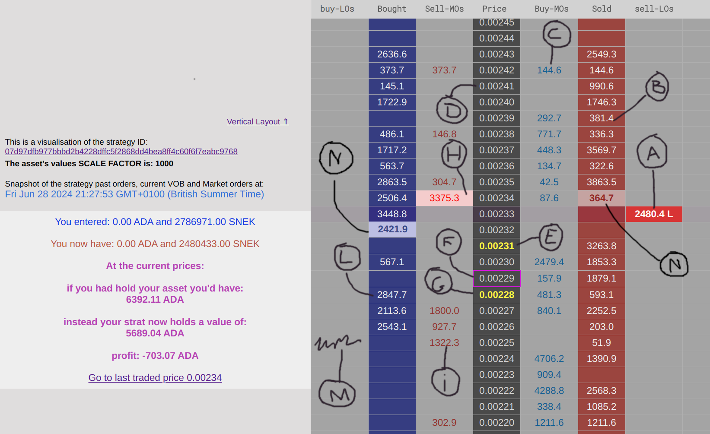

# What is it?

**axo-strat-visualiser** is a set of scripts that query the AXO API to gather the same information on a strategy that you can see on their website (https://app.axo.trade/). These scripts then process the information to make it more readable or present it differently using concepts of the Depth Of Market visualization or Price Ladder. The result is visualized in a local HTML page.

A rough estimate of the strategy profits is also calculated and visualized.

Here is an image as an example of the result:



### Legend: 

- **A.:** An open Limit Order set by the strategy. On the AXO website, you can find it on the strategy page under the "Current VOB" tab.
- **B.:** These are the Limit Orders of the strategy that have been executed because they matched with a Market Order. It is possible that executions at different times but at the same price level get accumulated. The red column represents Offer Limit Orders, meaning Limit Orders that the strategy has sold. These strategy trades are also found on the AXO strategy page under the "Trade History" tab.
- **C.:** These are Market Orders not related to the strategy. They are Market Orders executed by anyone in the market, taking liquidity, usually from Market Making strategies. On the right, in blue font, are the buy Market Orders that bought into Offer Limit Orders.
- **D.:** This grey column labels each price level. You can choose the step at which the price level increases.
- **E.:** This highlights the lowest Offer Limit Order, usually defined as the Ask, indicating the current lowest price at which it is possible to buy the asset.
- **F.:** This is the spot price, defined as the middle price between the ask and bid prices, or the lowest Offer Limit Order and the highest Bid Limit Order.
- **G.:** This is the bid price, the highest price at which you can sell into a Limit Order.
- **H.:** This indicates the last Market Order that was executed, usually determining the price (if not the spot price). When in pink and in the left column, it means the last trade was a sell. If the last trade was a buy, it will have a blue background and be in the right column. These trades typically alternate between left and right, sell and buy, like a tennis match.
- **I.:** These are the latest Sell Market Orders similar to point C. They also accumulate if more than one Market Order was executed at the same price level.
- **L.:** These are the Buy Limit Orders of the strategy that have been matched with a Sell Market Order, corresponding to point B.
- **M.:** In this particular strategy visualization, there weren't any open Buy Limit Orders for the strategy at this time. If there were any, they would be visualized similarly to those at point A, but with a blue background and in the leftmost column.
- **N.:** This two highlighted cells in the strategy trades column indicate the latest strategy trades for both the buy and sell side. In other words the last exectued Limit Orders, Bid and Ask from the strategy.

# Prerequisits

Need to have `curl` and `nodejs` installed. Is possible to run them on Windows but not sure what's the best route. Also there are `.sh` scripts that i am sure is possible to run on Windows too, but not sure either on what's the requirement, I am sure is googlable. Otherwise MacOS and linux is the best to run this scripts.

On MacOS and Linux should come wiht them already but `curl` is easy to install with:

```sh
#MacOS
brew install curl
echo 'export PATH="$(brew --prefix)/opt/curl/bin:$PATH"' >> ~/.zshrc
source ~/.zshrc
```

```sh
#Linux Debian
sudo apt-get update
sudo apt-get install curl
```

Quick google search for NodeJS will tell you for its installation, on Windows too.


# How To

Clone this repository locally and get into its folder `cd axo-strat-visualiser`

With the above installed is enough to run the file from terminal with `./renderStrat.sh <Strategy ID> [<Asset ID if other than AXO>] [SCALE_FACTOR to divide assets value if like with SNEK are too big]` 

> Note: it is possible to run on Windows, but you'll need to do some reasearch on how to, installing WSL on Windows should solve all problem btw, it is like a virtual Linux inside Windows.

If the file doesn't run, just run this command first to give the file excutable permission `chmod +x ./updateJSON.sh`.

After `renderStrat.sh` script run, open yout browser on the page that the script just created: `renderStrat_page/index.html`.

# Settings

When you run the script you will need to give as argument the Strategy ID:

```sh
$ ./renderStrat.sh 1a5458a13a2c63d527d514068fc3012da1d8e3858f3bcc95d41a5643
```

But if you are not using the `ADA / AXO` pair you will need to specify also the other Asset as AXO is set as default.

Here an example for Liqwid `ADA / LQ` pair:

```sh
$ ./renderStrat.sh 3e6655bfe870a02109e44e48bb37633e1923635f0c1a73d31a708835 da8c30857834c6ae7203935b89278c532b3995245295456f993e1d244c51
```

For few assets (currently LQ, SNEK, iUSD, LENFI, WMT ..) also ticker text is supported, so you coul write:

```sh
$ ./renderStrat.sh 46bc2d991b77499e46c5ea918ecf246caea13618e7729d596eb59267 LQ
```

> Note: Non ADA pair are not supported yet.

## Tick size

At the moment the tick size, that decides the steps in the price ladder, works with the AXO price and similar magnitude prices, but for things like SNEK where prices are much smaller it needs to be lower.

By default the TICK size is "0.01" (which works for AXO and LQ pairs) but for SNEK you'll need something more like "0.00001".

To achieve this, you can give a third argument to `./renderStrat` like this:

```sh
$ ./renderStrat.sh 474efaf7981c277373bbc003805a1dc5ace60f6071338dc9d0fb7273 SNEK 0.00001
```

## Scale Factor

For some assets with extremely low prices, the CNT may trade in the millions, so you may want to specify a SCALE_FACTOR that will divide all CNT values by that SCALE_FACTOR. i.e.:

```sh
$ ./renderStrat.sh 3c5c3afcce7bd1a330f43e7b45385d5511afc5f5c8b76e47c5e6e3a5 SNEK 0.00001 1000
```

If you need to skip a value but need to input an argument after that, just insert a dash "-":
```sh
$ ./renderStrat.sh 3c5c3afcce7bd1a330f43e7b45385d5511afc5f5c8b76e47c5e6e3a5 SNEK - 1000
```
In this case the TICK wil default to 0.01 which for SNEK will be far too big, and all the trades will be probably condensed in one price level (TICK).


# Replay Mode

### Intro

This Replay Mode it is simply a set of scripts to fetch data at certain interval (using Linux crontab to launch the script every x time), after which the data fetched can be reorganised from a script that prepares the data to be rendered by a local webpage that replays all of the data recorded at a higher speed.

In the future will be possible to set the speed, but for now it is set as such that 33 hours will be compressed in 30 seconds.

> Note: VOB strategy Limit Orders and SpotPrice/AskBid will have the same granularity as the Cronjob you are setting up, while the Market Orders trades and Strategy Trades, will have a higer time granularity as they are timestamped with the actual time they happened rather than the timestamp of when the cronjob happened as in with spotPrice and VOB strat positions. It is something that may be improved in the future.

You can still modify such parameters giving different arguments when running `renderReplayStorageFactory.js` (see below).

### How To

run `./initiateReplayStorage.sh` to clean up the folder and prepare empty files. (will delete all existing, move somewhere else if required)

`fetchReplayData.sh` can be used with a cron job to gather data from AXO api every x time.

i.e. here is an example to also log messages into a loggi.log file of a cronjob that fetches data every 5 minutes:
```sh
*/5 * * * * cd <axo-strat-visualiser_FOLDER> && ./fetchReplayData <axo_strategy_ID> <CNT_ASSET_ID_or_TICKER_if_supported> > ./loggi.log 2>&1
```
add the line to the crontab text file after running `crontab -e`.

when data is enough and ready stop the cronjob and run `node renderReplayStorageFactory.js` to tranfer the JSON to js files that can be read from the js inside `replay_page/`.

`renderReplayStorageFactory.js` has parameters to change from where it fishes the recorded data (default is `./replay_database`) so that you can fish from archives that you copied in other locations.

here a few example on posible config of `renderReplayStorageFactory.js`. Notice that if you skip an argument you need to leave a dash "-" if there are other arguments after it.

```sh
# run the following to see examples of how to give arguments to renderReplayStorageFactory.js
$ node renderReplayStorageFactory.js -h
# node renderReplayStorageFactory.js <location_to_read_from> <TICK> <SCALE_FACTOR> <CRONJOB_INTERVAL> <SPEED_OF_REFRESH>
# node renderReplayStoraeFactory.js <default: ./replay_database> <d: 0.01> <d: 1> <d: 300> <d: 200>"
```

the last two arguments define the step that the interval recorded will be divided into (`CRONJOB_INTERVAL`) and the speed of refresh with which the the render function will update (`SPEED_OF_REFRESH`) for each of this divisions. All values are considered in seconds.

When `renderReplayStorageFactory.js` run successfully you can launch the web page `/replay_page/index.html` from you browser.

# Side Notes

> If the strat executes market Orders they will still appear as Limit Orders matched.